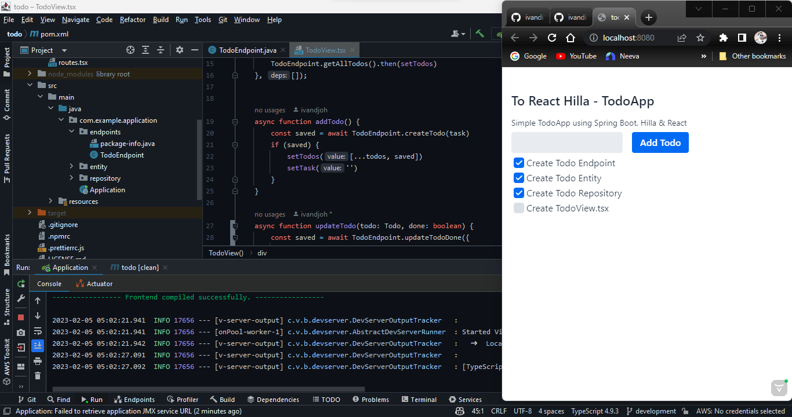

# To React Hilla

This project can be used as a starting point to create `Hilla application` with `Spring Boot`.
It contains all the necessary configuration and some placeholder files to get you started.

## Getting Started

```bash
git clone https://github.com/ivandi1980/to-react-hilla.git
```

## Running the application

The project is a standard Maven project. To run it from the command line,
type `mvnw` (Windows), or `./mvnw` (Mac & Linux), then open
http://localhost:8080 in your browser.

You can also import the project to your IDE of choice as you would with any
Maven project.

## Project Screenshot


